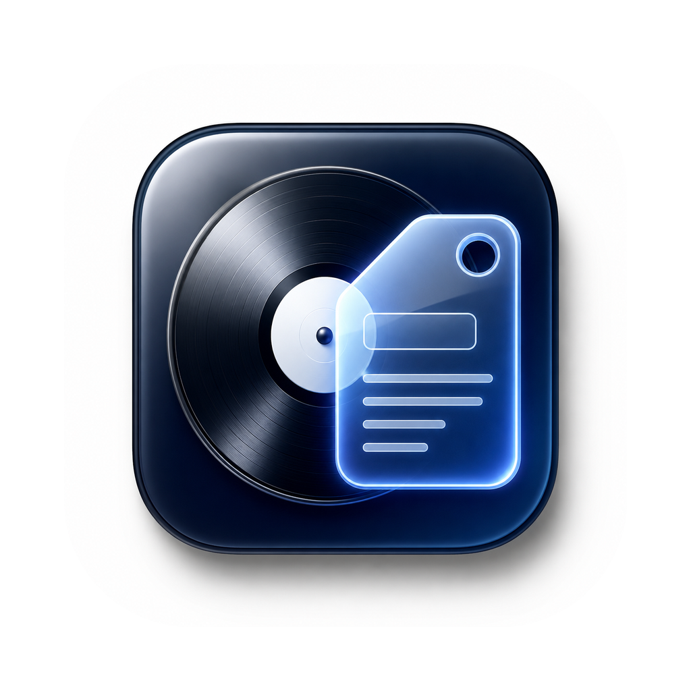

# Craftag

A fast, cross-platform audio tag editor built with Python and PySide6.



---

## Features

- Edit tags for **MP3, FLAC, M4A/AAC, OGG, Opus, WAV, AIFF, WavPack**
- Batch-edit shared fields across multiple selected files
- Embedded album art — set, replace, or remove per file
- **Auto-Fill** — look up missing metadata from iTunes with one click
- Dirty-state indicator (● dot) and unsaved-changes warning before close
- File queue search / filter by title, artist, or filename
- Format badge (MP3, FLAC…) on every queue item
- Auto track numbering for albums (1…N)
- Rename files from tags (`{track} - {artist} - {title}`)
- Star rating widget (1–5), BPM, lyrics, and composer fields
- Save All — background-threaded, with a status-bar progress bar
- System dark mode — follows macOS / OS appearance automatically
- Keyboard shortcuts throughout

---

## Download

**[devapps-online.vercel.app](https://devapps-online.vercel.app)**

Pre-built packages for macOS, Windows, and Linux are linked on the site above.

---

## Running from Source

### Requirements

- Python 3.9+
- pip

### Setup

```bash
git clone https://github.com/snowRepo/Craftag.git
cd Craftag

python3 -m venv venv
venv/bin/pip install -r craftag_py/requirements.txt
```

### Launch

```bash
# macOS / Linux
./run.sh

# or directly
venv/bin/python -m craftag_py.main
```

---

## Supported Formats

| Format   | Extension(s)          | Tag Standard     | Art | BPM | Rating | Lyrics |
|----------|-----------------------|------------------|-----|-----|--------|--------|
| MP3      | `.mp3`                | ID3v2.3          | ✅  | ✅  | POPM   | USLT   |
| FLAC     | `.flac`               | Vorbis Comment   | ✅  | ✅  | ✅     | ✅     |
| M4A/AAC  | `.m4a` `.aac` `.mp4`  | iTunes Atoms     | ✅  | ✅  | ✅     | ✅     |
| OGG      | `.ogg`                | Vorbis Comment   | ✅  | ✅  | ✅     | ✅     |
| Opus     | `.opus`               | Vorbis Comment   | ✅  | ✅  | ✅     | ✅     |
| WAV      | `.wav`                | ID3v2.3          | ✅  | ✅  | POPM   | USLT   |
| AIFF     | `.aif` `.aiff`        | ID3v2.3          | ✅  | ✅  | POPM   | USLT   |
| WavPack  | `.wv`                 | APEv2            | —   | ✅  | ✅     | ✅     |

---

## Keyboard Shortcuts

| Shortcut              | Action                  |
|-----------------------|-------------------------|
| `⌘O` / `Ctrl+O`      | Open audio files        |
| `⌘⇧O` / `Ctrl+Shift+O` | Open folder           |
| `⌘S` / `Ctrl+S`      | Save All                |
| `⌘A` / `Ctrl+A`      | Select all in queue     |
| `Delete` / `Backspace`| Remove selected from queue |
| `Escape`              | Close full-size art view |

---

## Auto-Fill (iTunes)

With a file selected and a title entered, press **Auto-Fill** in the editor panel. Craftag searches iTunes and pre-fills any **empty** fields (Album, Artist, Year, Genre, Track, Album Artist). Existing data is never overwritten.

---

## Development

### Running tests

```bash
pip install -r requirements-dev.txt
pytest tests/ -v
```

### Project layout

```
Craftag/
├── craftag_py/
│   ├── core/
│   │   ├── tag_io.py          # All format read/write logic
│   │   └── itunes.py          # iTunes API lookup
│   ├── ui/
│   │   ├── main_window.py     # Application window & menus
│   │   ├── editor_panel.py    # Tag editor panel
│   │   ├── file_list.py       # Left sidebar / queue
│   │   └── widgets.py         # Reusable custom widgets
│   ├── __version__.py
│   └── main.py
├── tests/
│   ├── conftest.py            # Fixtures (temp audio files per format)
│   └── test_tag_io.py         # Round-trip read/write tests
├── version.json               # Published version manifest (update checker)
├── requirements-dev.txt
└── run.sh
```

---

## License

See [license.txt](license.txt).
